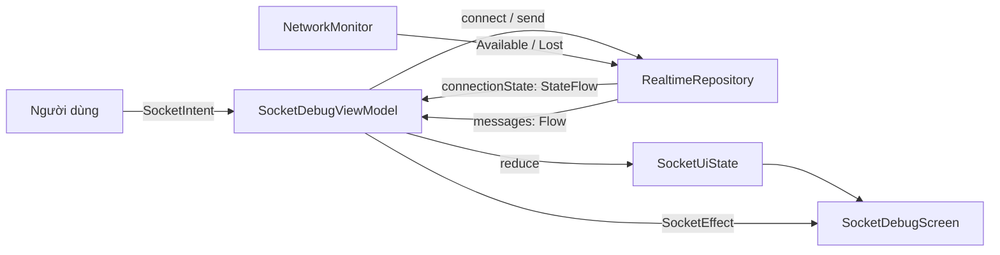

# WebSocket — từ số 0

Đọc từ trên xuống. **Phần A** dạy giao thức cho người chưa biết gì về WebSocket (nhưng biết lập
trình). **Phần B** giải thích code trong `app/.../socket/`.

---

# PHẦN A — GIAO THỨC

## A1. Bài toán: server muốn nói trước

Bạn làm app chat. Người B gửi tin nhắn cho người A. **Điện thoại của A làm sao biết có tin mới?**

Nghe thì tưởng dễ, nhưng HTTP — thứ mọi app Android đang dùng để gọi API — **không làm được việc
này**. HTTP chỉ có đúng một kiểu tương tác:

```
client:  "cho tôi /messages"      ← client PHẢI hỏi trước
server:  "đây, 3 tin nhắn"        ← server chỉ được TRẢ LỜI
                                  ← xong. Kết nối đóng. Hết chuyện.
```

Server **không có cách nào bắt đầu một câu chuyện**. Nó chỉ biết trả lời. Muốn nói gì với client
thì phải đợi client hỏi.

> Ví von: HTTP giống bạn nhắn tin cho tổng đài. Bạn hỏi thì họ đáp. Họ **không có số của bạn**,
> nên có tin gì hay ho cũng đành ngồi im đợi bạn hỏi lại.

Đây không phải lỗi thiết kế. HTTP sinh ra năm 1991 để tải trang web, và với việc đó thì
request/response vừa đủ vừa tối ưu: bạn muốn xem trang nào thì hỏi trang đó.

### "Server nói trước" nghĩa là gì

Có **hai loại dữ liệu** hoàn toàn khác nhau, và chỉ một loại cần WebSocket.

**Loại 1 — client tự biết khi nào mình cần.** Bạn mở app, muốn xem danh sách sản phẩm ⇒ gọi
`GET /products`. Dữ liệu đó đã nằm sẵn trên server từ hôm qua, chờ ai hỏi thì đưa. Bạn muốn xem
lúc nào thì hỏi lúc đó. **HTTP quá đủ, đừng động vào.**

**Loại 2 — dữ liệu sinh ra ở chỗ khác, vào lúc không ai đoán trước được.** Client không có bất kỳ
manh mối nào để biết "à, đúng lúc này thì nên hỏi". Đây mới là loại cần server nói trước:

| Tình huống | Dữ liệu mới sinh ra ở đâu, lúc nào | Vì sao client không tự hỏi được |
|---|---|---|
| **Chat** | B gõ xong tin, bấm gửi, lúc **14:03:27** | máy A lấy đâu ra thông tin để biết 14:03:27 là lúc đáng hỏi? |
| **Thông báo đẩy** | server quyết định bắn khuyến mãi | thời điểm hoàn toàn do server chọn |
| **Giá cổ phiếu** | sàn khớp lệnh, vài lần **mỗi giây** | hỏi 1 lần/giây vẫn trễ, mà vẫn tốn vô ích |
| **Vị trí tài xế** | điện thoại **tài xế** bắn GPS lên mỗi 3 giây | dữ liệu sinh ở **thiết bị khác**, app khách chỉ ngồi xem |
| **Cuộc gọi đến** | người kia bấm gọi lúc **20:15** | máy bạn phải reo **ngay**, không phải reo ở lần hỏi kế tiếp |

Điểm chung của cả năm: **người tạo ra dữ liệu không phải bạn, và lúc họ tạo ra thì bạn không đoán
được.**

Mà HTTP thì bắt buộc client phải hỏi trước. Vậy khi không đoán được lúc nào đáng hỏi, chỉ còn một
cách: **đoán mò và hỏi liên tục.** Đó chính là mục A2.

## A2. Ba cách chống chế (và vì sao chúng không đủ)

Trước khi WebSocket ra đời (2011), người ta lách bằng ba cách. Hiểu chúng thì mới thấy WebSocket
giải quyết đúng cái gì.

### Cách 1 — Short polling: cứ hỏi liên tục

```
client: "có gì mới không?"  → server: "không"     (0 giây)
client: "có gì mới không?"  → server: "không"     (2 giây)
client: "có gì mới không?"  → server: "không"     (4 giây)
client: "có gì mới không?"  → server: "CÓ! 1 tin" (6 giây)
```

Đơn giản, code 10 phút xong. Nhưng:
- Hỏi mỗi 2 giây = **1.800 request/giờ**, và ~99% trả về rỗng.
- Mỗi request kéo theo full header HTTP (cookie, token, user-agent…) — vài trăm byte cho một câu
  trả lời "không có gì".
- **Tốn pin kinh khủng**: mỗi request đánh thức radio 3G/4G. Bật radio tốn năng lượng hơn nhiều so
  với chính lượng dữ liệu gửi đi.
- Tin nhắn vẫn **trễ tới 2 giây** — vì phải đợi lần hỏi kế tiếp.

Muốn giảm trễ thì phải hỏi dày hơn, mà hỏi dày hơn thì càng tốn. Đường cùng.

### Cách 2 — Long polling: hỏi rồi bắt server ngậm luôn

```
client: "có gì mới không?"
server: ................ (im lặng, GIỮ request treo)
        ................ (30 giây trôi qua)
server: "CÓ! 1 tin"      ← chỉ trả lời khi thật sự có tin
client: "có gì mới không?"  ← hỏi lại ngay
```

Khá hơn hẳn: không còn request rỗng, tin nhắn về gần như tức thì. Đây là cách Facebook Chat chạy
những năm 2008. Nhưng:
- **Mỗi tin nhắn tốn một kết nối mới.** Trả lời xong là request kết thúc, client phải mở lại từ
  đầu: TCP handshake + TLS handshake ≈ vài trăm ms và vài KB, **cho mỗi tin nhắn**.
- Proxy và load balancer thường **tự cắt** request treo quá 30–60 giây, nên phải xử lý timeout.
- Vẫn **một chiều**. Client muốn gửi thì phải mở thêm một request khác.

### Cách 3 — SSE (Server-Sent Events): giữ một kết nối, server đẩy liên tục

Một request HTTP duy nhất, không đóng, server ghi dần dữ liệu xuống. Client đọc tới đâu xử lý tới đó.

Đây gần đúng rồi — một kết nối, nhiều tin nhắn. Nhưng:
- **Chỉ một chiều** (server → client). Client gửi thì vẫn phải POST riêng.
- **Chỉ gửi được text**, không gửi được nhị phân (ảnh, audio).

### Cái còn thiếu

Cả ba đều cố nhét một thứ **hai chiều, liên tục** vào một giao thức sinh ra để **một chiều, đứt
quãng**. Thứ ta thật sự cần:

> Một đường dây **mở sẵn**, **hai bên đều nói được bất cứ lúc nào**, **dùng đi dùng lại** cho mọi
> tin nhắn.

Đó chính xác là WebSocket. Nhưng trước khi định nghĩa nó, phải trả lời một câu mà A1 và A2 cố tình
nợ lại: **HTTP thật ra chạy bên trên cái gì?**

## A3. Bên dưới HTTP là gì — TCP trong 3 phút

Mục này không nói về WebSocket. Nhưng thiếu nó thì mọi thứ từ A4 trở đi chỉ là chữ để học thuộc.
Trong app Android bạn không bao giờ gọi TCP trực tiếp — OkHttp/Retrofit làm hộ hết. Từ đây trở đi
thì phải nhìn thấy nó, vì **WebSocket bắt bạn tự quản lý đúng cái ống này**.

### Trước khi chữ "GET" được gửi đi

Bạn viết `retrofit.getProducts()`. Trước khi ký tự `G` của `GET` rời khỏi máy, có một việc xảy ra
trước: máy bạn và server **mở một kết nối TCP**.

**TCP là một cái ống dẫn byte, hai chiều, giữa hai máy.** Mở một lần (tốn một vòng đi-về gọi là
3-way handshake), sau đó **cả hai đầu đều ghi byte vào và đọc byte ra** cho tới khi ai đó đóng.

```
   máy bạn  ══════════════ ống TCP ══════════════  server
            ──────→  byte đi ra                          (bạn ghi, server đọc)
            ←──────  byte đi vào                         (server ghi, bạn đọc)
```

TCP **đảm bảo** ba điều: byte tới **đủ**, **đúng thứ tự**, **không trùng lặp**.

TCP **không** đảm bảo hai điều — và cả hai sẽ quay lại cắn bạn ở phần sau:
- không giữ **ranh giới tin nhắn** (→ A6, lý do có "frame")
- không **báo cho bạn biết khi đầu kia chết** (→ A7, cái bẫy "half-open")

> **Đối chiếu Kotlin:** một kết nối TCP giống **hai `Channel<Byte>` chạy ngược chiều nhau, đã mở
> sẵn**. Không có khái niệm "gọi hàm", không có "request". Chỉ có `send` và `receive` ở cả hai đầu.

### Cú twist: ống đó vốn ĐÃ hai chiều

Đọc kỹ sơ đồ trên. Server **hoàn toàn có thể ghi byte xuống bất cứ lúc nào nó muốn** — TCP không hề
cấm. Vậy tại sao A1 lại nói "server không có cách nào nói trước"?

**Vì HTTP tự đặt ra luật chơi trên cái ống đó:**

```
luật của HTTP trên một ống TCP:
  1. client ghi trước   → đó là request
  2. server ghi sau     → đó là response
  3. hết response = hết lượt. Server không được ghi thêm gì nữa.
```

Đây là **quy ước của HTTP**, không phải giới hạn của TCP. Đường dây thì hai chiều; chỉ là **nội quy
cấm server mở miệng trước**.

> **Ví von:** TCP = **đường dây điện thoại đã nối xong**, hai bên nghe nói được hết.
> HTTP = **nội quy "chỉ được trả lời khi người kia hỏi"** dán lên đường dây đó.
> Vấn đề của A1 chưa bao giờ là đường dây. Vấn đề là cái nội quy.

### Nhìn lại A2 dưới ánh sáng này

Ba cách chống chế ở A2 giờ hiện nguyên hình — **cả ba đều giữ nguyên nội quy HTTP và chỉ lách quanh
nó**:

| Cách | Nó làm gì với ống TCP | Nội quy bị lách chỗ nào |
|---|---|---|
| Short polling | mở ống → hỏi → đóng → **lặp lại** | không lách gì cả, chỉ hỏi thật nhiều |
| Long polling | mở ống → hỏi → **bắt server ngậm** rồi mới đáp | kéo dài bước 2 ra |
| SSE | mở ống → server **ghi mãi không dứt** | bỏ bước 3, nhưng **client vẫn bị cấm ghi thêm** |

Không cách nào dám bỏ hẳn nội quy, vì làm vậy thì **không còn là HTTP nữa** — mà đường đi từ máy bạn
tới server đầy những máy trung gian **chỉ hiểu HTTP**. Chúng là ai, và vì sao bạn không gạt chúng ra
được, là mục ngay dưới đây.

### Trên đường đi có ai — proxy, firewall, load balancer

Giữa điện thoại và server **không phải một sợi dây thẳng**. Gói tin đi qua một dãy máy trung gian mà
**bạn không đặt ở đó và không tắt được**:

```
điện thoại ─→ [Wi-Fi công ty]  ─→ [nhà mạng] ─→ internet ─→ [phía server]        ─→ server
                firewall                NAT                    CDN / WAF
                proxy                                          load balancer
              ↑ admin mạng dựng, bạn không đụng vào được    ↑ team backend dựng
```

| Máy | Ai dựng nó | Việc của nó là gì | Nó đụng WebSocket ở đâu |
|---|---|---|---|
| **Firewall** | admin mạng công ty / trường / quán | quyết định gói tin nào được ra khỏi mạng. Thường **chỉ mở port 80 và 443**, chặn hết phần còn lại — để giảm bề mặt tấn công và chặn nhân viên chơi game / torrent / VPN lậu | port lạ = **drop thẳng**, không báo gì. Đây là lý do WebSocket buộc phải bám 80/443 |
| **Proxy** (forward) | admin mạng doanh nghiệp | mọi HTTP phải đi qua nó: **cache** file nhiều người cùng tải, **lọc** nội dung bị cấm, **ghi log** ai vào trang nào | proxy đời cũ không hiểu header `Upgrade` ⇒ **cắt bỏ nó** ⇒ handshake hỏng, server không bao giờ biết bạn muốn nâng cấp |
| **NAT** | nhà mạng + router nhà bạn | 20 thiết bị dùng chung 1 IP công cộng, nó nhớ gói nào của ai | xoá "trí nhớ" khi kết nối im lặng quá lâu → A7 |
| **CDN / WAF** | team backend (Cloudflare, Fastly…) | cache tĩnh, chống DDoS, chặn request độc | có timeout riêng cho kết nối sống lâu |
| **Load balancer** | team backend | app chạy trên 10 máy giống nhau; LB **rải request đều** ra 10 máy đó. Cũng là chỗ **kết thúc TLS** và là thứ cho phép deploy bản mới không downtime | **idle timeout**: không thấy byte nào chạy qua trong khoảng ~60 giây là nó **tự cắt** kết nối |

**Vì sao chúng "chỉ hiểu HTTP":** vì để làm được việc của mình, chúng bắt buộc phải **đọc hiểu nội
dung đang chạy qua**:

- Load balancer muốn gửi `/api/*` sang cụm A, `/static/*` sang cụm B ⇒ phải **parse được dòng đầu
  của HTTP request**.
- Proxy muốn cache ⇒ phải hiểu `GET`, `Cache-Control`, `Content-Length` mới biết cái gì cache được
  và cache bao lâu.
- Firewall lọc theo nội dung ⇒ phải đọc được header.

Gặp một giao thức lạ trên một port lạ, chúng **không có luật nào để áp**. Và mặc định an toàn của
một thiết bị an ninh không bao giờ là "cho qua" — mặc định là **chặn**.

> **Nói cho chính xác — không có luật nào bắt buộc mấy máy này phải tồn tại.** Điện thoại dùng 4G nối
> thẳng tới server có thể chẳng gặp proxy doanh nghiệp nào cả. Vấn đề không phải "luôn có", mà là
> **bạn không thể biết**: người dùng của bạn đang ngồi trong Wi-Fi công ty nào, dùng nhà mạng nào,
> ở quán cà phê nào — hoàn toàn ngoài tầm kiểm soát của bạn.
>
> Nên giao thức phải thiết kế theo **trường hợp xấu nhất**: cứ coi như trên đường đi có đủ cả. Chạy
> được ở chỗ tệ nhất thì chỗ nào cũng chạy được.

**Ba hệ quả bạn sẽ gặp lại nguyên văn ở phần sau — cả ba đều sinh ra từ đúng bảng trên:**

1. **Handshake phải giả dạng một HTTP request trên port 80/443** (A5). Không phải để cho đẹp, mà để
   **đi lọt qua firewall và proxy**.
2. **Phải ping định kỳ** (A7). Không chỉ vì NAT — mà còn vì **load balancer cắt kết nối im lặng sau
   ~60 giây**. Một cuộc chat không ai nhắn gì trong 2 phút là đủ để bị cắt, dù cả hai đầu vẫn sống
   nhăn.
3. **`wss://` chui lọt tốt hơn `ws://`** (A10). Vì traffic đã mã hoá TLS thì proxy **không đọc
   được** — mà không đọc được thì không nghịch được.

### Chốt lại A3

**WebSocket không phát minh ra kết nối hai chiều — TCP đã hai chiều từ RFC 793 năm 1981**, tức mười
năm trước khi HTTP tồn tại. Nó chỉ làm đúng một việc: **xin phép gỡ bỏ nội quy HTTP** trên một ống
TCP đã mở, và xin phép một cách lịch sự đến mức toàn bộ dãy máy trung gian ở trên đều cho qua mà
không nhận ra có gì thay đổi. Cách xin phép đó là A5.

## A4. WebSocket là gì

**Định nghĩa một câu:** WebSocket là **vẫn cái ống TCP đó**, nhưng sau một lời xin phép ngắn thì
**nội quy hỏi-đáp của HTTP bị gỡ bỏ** — từ đó hai bên đều ghi được bất cứ lúc nào.

```
        ┌──────────── một kết nối TCP duy nhất, mở suốt ────────────┐
client  │ →  "chào"                                                 │  server
        │                                        "có tin mới"  ←    │
        │ →  "ok"                                                   │
        │                                        "B đang gõ…"  ←    │
        └───────────────────────────────────────────────────────────┘
```

Để ý: sơ đồ này **giống hệt** sơ đồ ống TCP ở A3. Đúng vậy — đó là cùng một thứ. Cái biến mất chỉ là
luật "phải hỏi mới được đáp".

Tính chất "hai bên cùng gửi được, kể cả gửi đồng thời" gọi là **full-duplex** (song công). So sánh:
bộ đàm là half-duplex — một lúc chỉ một người nói. Điện thoại là full-duplex — cả hai cùng nói được
(dù nghe sẽ hơi rối).

> **Ví von (nối tiếp A3):** đường dây vẫn là đường dây cũ. WebSocket chỉ là **gỡ tờ nội quy xuống**.
> HTTP = nhắn tin qua tổng đài. WebSocket = **cuộc gọi đang mở**: đã bắt máy rồi thì ai muốn nói lúc
> nào cũng được, không phải bấm số lại mỗi câu.

> **Đối chiếu Kotlin:** HTTP request = `suspend fun getMessages(): List<Message>` — gọi, chờ, có kết
> quả, xong. WebSocket = **hai `Channel` ngược chiều đã mở sẵn** (chính là cặp channel ở A3, giờ
> được dùng đúng khả năng của nó): không ai "gọi" ai, cả hai cùng `send` và cùng `receive`.

### Cái giá phải trả

Gỡ nội quy đi thì cũng mất luôn những thứ nội quy đó lo hộ. **Bảng này là toàn bộ nội dung của Phần
B** — chưa hiểu mấy dòng dưới cũng không sao, mỗi dòng có một mục riêng ở sau:

| | HTTP | WebSocket | Học ở đâu |
|---|---|---|---|
| Kết nối đứt | request lỗi, bạn retry request đó | **bạn tự phát hiện, tự nối lại** | A7, A9 |
| Biết đối phương còn sống? | không cần, mỗi request độc lập | **bạn tự lo (ping/pong)** | A7 |
| Đứt vì lý do gì | không quan trọng, cứ retry | **phải phân biệt: nối lại hay dừng hẳn** | A8 |
| Trạng thái | không có (stateless) | **có, và bạn phải quản lý nó** | Phần B |

Nói cách khác: **WebSocket cho bạn cái đường ống, còn giữ cho ống đó không tắc là việc của bạn.**
Đó là lý do một class "WebSocket client" tử tế dài 250 dòng chứ không phải 20.

## A5. Kết nối bắt đầu thế nào — handshake

### Vì sao không mở hẳn một port riêng cho gọn?

Đây là hệ quả số 1 của bảng "trên đường đi có ai" ở A3: **firewall doanh nghiệp thường chỉ mở port
80 và 443**, port lạ bị drop thẳng. Mở port riêng nghĩa là bỏ luôn tệp người dùng đang ngồi trong
mạng công ty, trường học, quán cà phê — mà bạn thì không biết trước ai đang ở đâu.

Nên WebSocket chơi bài khôn: **bắt đầu bằng một request HTTP hoàn toàn bình thường**, đi lọt qua
mọi hạ tầng sẵn có, rồi mới xin đổi giao thức ngay trên kết nối TCP đó.

### Client xin nâng cấp

```http
GET /echo HTTP/1.1
Host: realtime-ws-lab.onrender.com
Upgrade: websocket                          ← "tôi muốn đổi giao thức"
Connection: Upgrade
Sec-WebSocket-Key: dGhlIHNhbXBsZSBub25jZQ==  ← 16 byte ngẫu nhiên, mã base64
Sec-WebSocket-Version: 13
```

Với mọi proxy trên đường đi, đây chỉ là một `GET` bình thường. Nó cho qua.

### Server đồng ý

```http
HTTP/1.1 101 Switching Protocols
Upgrade: websocket
Connection: Upgrade
Sec-WebSocket-Accept: s3pPLMBiTxaQ9kYGzzhZRbK+xOo=
```

**`101` là mã trạng thái quan trọng nhất ở đây** — nó nghĩa là "được, từ giây này trở đi kết nối
TCP này không còn là HTTP nữa". Không phải `200`. Nếu bạn debug và thấy `200`, `404`, `403` thì
handshake đã hỏng.

**Sau `101`: cùng một kết nối TCP, nhưng đổi ngôn ngữ.** Không còn header, không còn status code,
không còn URL. Từ đây chỉ còn **frame nhị phân** của WebSocket (mục A6).

### `Sec-WebSocket-Key` / `Accept` để làm gì?

Đây là câu hay bị hỏi và hay bị trả lời sai. **Nó KHÔNG phải bảo mật, KHÔNG phải xác thực.**

Server tính:

```
Accept = base64( SHA1( Key + "258EAFA5-E914-47DA-95CA-C5AB0DC85B11" ) )
```

Chuỗi GUID kia là **hằng số ghi cứng trong RFC 6455** — ai cũng biết, không phải bí mật. Vậy nó
chứng minh cái gì? Chứng minh **server thật sự hiểu WebSocket**, chứ không phải một proxy/cache
ngây thơ tình cờ trả về `101`.

Tình huống nó chặn: kẻ tấn công dụ được một proxy trung gian cache lại một response trông giống
`101`. Client sau kết nối vào, tưởng đã bắt tay xong với server thật, nhưng thực ra đang nói chuyện
với rác trong cache. Bắt buộc phải tính đúng `Accept` từ `Key` **ngẫu nhiên của riêng lần này** thì
response cache lại không bao giờ khớp.

## A6. Dữ liệu đi qua kiểu gì — frame

### Vấn đề: TCP không có khái niệm "tin nhắn"

Đây là chỗ hầu hết tài liệu bỏ qua, mà không hiểu nó thì không hiểu vì sao có "frame".

**TCP là một dòng byte liên tục.** Nó đảm bảo byte tới đủ và đúng thứ tự, nhưng **không** đảm bảo
ranh giới. Bạn gửi hai tin:

```
send("hello")
send("world")
```

Bên kia hoàn toàn có thể đọc ra:
```
lần đọc 1: "hellowor"
lần đọc 2: "ld"
```

TCP không sai — nó chưa bao giờ hứa giữ ranh giới. Nó chỉ hứa: byte nào bạn đưa vào, bên kia nhận
đúng byte đó, đúng thứ tự.

> **Đối chiếu Kotlin:** TCP giống một `Flow<Byte>`, không phải `Flow<Message>`. Muốn có
> `Flow<Message>` thì **bạn phải tự gom byte lại và tự cắt**.

Vậy làm sao biết tin nhắn kết thúc ở đâu? Mọi giao thức đều phải tự giải quyết:
- HTTP dùng header `Content-Length: 42` (hoặc chunked encoding).
- WebSocket dùng **frame**.

### Frame = một cái nhãn nhỏ dán trước dữ liệu

Mỗi lần gửi, WebSocket bọc dữ liệu trong một frame. Nhãn (header) chỉ **2–14 byte**, nói ba điều:

1. **Đây là loại gì?** → trường `opcode`
2. **Dài bao nhiêu byte?** → trường `payload length`
3. **Đã hết tin chưa hay còn phần sau?** → cờ `FIN`

Đọc frame thì chỉ việc: đọc nhãn → biết cần đọc thêm bao nhiêu byte nữa → đọc đúng chừng đó → xong
một tin. Ranh giới rõ ràng.

**Đây cũng là chỗ WebSocket rẻ hơn HTTP bao nhiêu, bằng con số:** một tin nhắn qua WebSocket tốn
thêm **2–14 byte**. Cùng tin nhắn đó qua HTTP tốn **vài trăm byte** header (`Host`, `Cookie`,
`User-Agent`, `Authorization`…) — mà đó là chưa kể có thể phải mở ống TCP + bắt tay TLS mới.

### `opcode` — frame này là loại gì

| opcode | Loại | Nghĩa |
|---|---|---|
| `0x1` | **text** | dữ liệu, chuỗi UTF-8 |
| `0x2` | **binary** | dữ liệu, byte thô (ảnh, audio, protobuf) |
| `0x0` | continuation | "đây là phần tiếp của tin trước" |
| `0x8` | **close** | "tôi đóng đây" |
| `0x9` | **ping** | "còn sống không?" |
| `0xA` | **pong** | "còn" |

Ba cái cuối gọi là **control frame** — chúng không phải dữ liệu của bạn, mà là **giao thức tự nói
chuyện với nhau**. App bình thường không thấy chúng; thư viện (OkHttp) tự xử lý.

> **Đối chiếu Kotlin:** `opcode` chính là discriminator của một `sealed interface Frame`. Đọc 4 bit
> đó rồi `when` ra nhánh xử lý — y hệt cách bạn `when (event)` trên một sealed class.

### `FIN` — vì sao cần chẻ nhỏ tin nhắn

Gửi một file 100 MB. Nếu bắt buộc một tin = một frame thì bên gửi phải nạp trọn 100 MB vào RAM để
tính độ dài trước khi gửi được byte đầu tiên.

`FIN = 0` nghĩa là "còn nữa". Cho phép chẻ một tin thành nhiều frame và **stream** nó đi:

```
frame 1: opcode=text(0x1),        FIN=0, data="Xin "
frame 2: opcode=continuation(0x0), FIN=0, data="chào "
frame 3: opcode=continuation(0x0), FIN=1, data="bạn"     ← FIN=1: hết tin
```

Bên nhận ghép lại thành `"Xin chào bạn"`. Chỉ frame đầu mang opcode thật; các frame sau là
`continuation`, nếu không thì bên nhận không phân biệt được "phần tiếp theo" với "một tin mới".

Control frame (ping/pong/close) thì **cấm chẻ**, và payload tối đa **125 byte**. Đổi lại, chúng
được phép **chen vào giữa** các mảnh của một tin dữ liệu — nếu không, đang gửi file 100 MB thì
ping bị kẹt đằng sau và bạn không thể kiểm tra kết nối còn sống trong suốt thời gian đó.

### `payload length` — dài co giãn để tiết kiệm

Trường độ dài chỉ 7 bit, đủ đếm tới 125. Tin dài hơn thì:

| Giá trị 7 bit | Nghĩa |
|---|---|
| `0`–`125` | đó chính là độ dài |
| `126` | "đọc thêm **2 byte** nữa mới là độ dài thật" (tới 64 KB) |
| `127` | "đọc thêm **8 byte** nữa" (tới rất lớn) |

Vì sao rắc rối vậy: 99% tin nhắn chat ngắn hơn 125 byte. Thiết kế này cho chúng chỉ tốn **2 byte**
header thay vì luôn luôn 10 byte. Với một app chat triệu người dùng, đó là hàng tấn băng thông.

### `MASK` — vì sao client bắt buộc phải xáo dữ liệu

Luật: **frame client → server BẮT BUỘC mask. Server → client CẤM mask.**

Mask = XOR payload với một khoá 4 byte ngẫu nhiên, và khoá đó **gửi kèm ngay trong frame**. Nghĩa
là ai đọc được frame cũng giải mask được — **nó không phải mã hoá**.

Vậy để làm gì? Chống **cache poisoning** ở proxy trung gian:

1. Kẻ tấn công lừa trình duyệt nạn nhân mở WebSocket tới server của hắn.
2. Hắn gửi qua kết nối đó một payload trông **y hệt một HTTP request hợp lệ**
   (`GET /jquery.js HTTP/1.1...`).
3. Proxy cũ kỹ trên đường đi đọc dòng byte đó, tưởng là một HTTP request thật, và **cache lại
   response độc hại** dưới tên `/jquery.js`.
4. Mọi người dùng khác qua proxy đó tải `jquery.js` sẽ nhận file của hacker.

Mask với khoá **ngẫu nhiên mỗi frame** khiến kẻ tấn công không thể điều khiển được chuỗi byte thật
sự đi trên dây ⇒ không dựng được request giả. Server không cần mask vì kẻ tấn công không điều khiển
được server.

### Ráp lại — sơ đồ frame

```
byte 0        byte 1        byte 2..9            byte tiếp        phần còn lại
┌──────────┐  ┌──────────┐  ┌────────────────┐   ┌───────────┐   ┌─────────────┐
│FIN RSV op│  │MASK  len │  │ độ dài mở rộng │   │ mask key  │   │   payload   │
│ 1   3  4 │  │  1    7  │  │ (0, 2 hoặc 8 B)│   │ (0 / 4 B) │   │             │
└──────────┘  └──────────┘  └────────────────┘   └───────────┘   └─────────────┘
```

Nhỏ nhất: **2 byte** (server→client, tin ngắn). Lớn nhất: **14 byte** (client→server, tin rất dài).
`RSV` là 3 bit dự trữ cho extension (ví dụ nén `permessage-deflate`), bình thường bằng 0.

## A7. Giữ kết nối sống — và cái bẫy tên là "half-open"

### Kịch bản

Bạn đang chat, bước vào thang máy, mất sóng 30 giây, đi ra. Nhìn app: **vẫn hiện "đang kết nối"**.
Bạn gõ một tin, bấm gửi. Ứng dụng báo gửi thành công. **Nhưng người kia không bao giờ nhận được.**

Đây là **half-open connection**: một đầu đã chết, đầu kia **không hề biết**.

### Vì sao TCP không tự phát hiện

Ba lý do, cộng lại thành thảm hoạ:

1. **TCP không gửi gì khi im lặng.** Không có traffic thì tuyệt đối không có tín hiệu nào để suy ra
   đầu kia còn sống hay đã chết. Kết nối "mở" chỉ là một dòng trong bảng của hệ điều hành.
2. **`SO_KEEPALIVE` mặc định TẮT**, và khi bật thì Linux mặc định **2 tiếng** mới thăm dò lần đầu.
   Vô dụng với chat.
3. **Ghi vào kết nối đã chết cũng không báo lỗi ngay.** TCP sẽ retransmit theo cấp số nhân và chỉ
   chịu bỏ cuộc sau **hàng chục phút**. `send()` của bạn trả về thành công vì nó chỉ có nghĩa "đã
   xếp vào buffer của kernel", không có nghĩa "đã tới nơi".

> **Đối chiếu Kotlin:** half-open giống `await()` trên một `CompletableDeferred` mà **không ai bao
> giờ gọi `complete()`**. Không exception, không log, không gì cả — chỉ treo vĩnh viễn. Và đây đúng
> nghĩa đen là chuyện xảy ra trong `connectOnce()` ở Phần B.

### Còn NAT nữa

Nhà bạn có 20 thiết bị nhưng chỉ **một IP công cộng**. Router phải nhớ "gói tin về cổng 54321 là
của điện thoại Nam" — bảng ghi nhớ đó gọi là **NAT mapping**.

Bảng có hạn, nên **router tự xoá những mapping im lặng quá lâu**. Trên mạng di động, ngưỡng này
thường chỉ **30 giây đến vài phút** (chuẩn khuyến nghị dài hơn nhiều, nhưng nhà mạng không theo).

Mapping bị xoá ⇒ gói tin server gửi về không biết đi đâu ⇒ **rơi im lặng**. Không ai được báo. Lại
half-open, lần này do hạ tầng chứ chẳng ai chết cả.

### Lời giải: ping/pong ở tầng WebSocket

Nhớ `opcode 0x9` và `0xA` ở A6? Đây là lúc dùng chúng.

```
client → ping (0x9)        ← định kỳ, ví dụ 20 giây một lần
server → pong (0xA)        ← RFC BẮT BUỘC trả lời, càng sớm càng tốt
```

Không thấy pong trong khoảng thời gian đã định ⇒ kết luận kết nối đã chết ⇒ huỷ và nối lại.

Nó giải quyết **ba** việc cùng lúc:
1. **Phát hiện chết sớm** — 20 giây thay vì hàng chục phút.
2. **Giữ NAT mapping sống** — có traffic đều đặn thì router không xoá.
3. **Không bị load balancer cắt** — LB phía server (A3) có **idle timeout**, không thấy byte nào
   chạy qua trong khoảng ~60 giây là tự đóng kết nối. Đây là lý do bị bỏ sót nhiều nhất: kết nối
   chết mà **cả hai đầu đều còn sống và mạng vẫn tốt** — thủ phạm là một cái máy ở giữa.

Chu kỳ ping là một đánh đổi thật sự: quá ngắn thì tốn pin (mỗi ping đánh thức radio, mà chuyển
radio từ ngủ sang thức tốn năng lượng hơn nhiều so với chính gói tin), quá dài thì NAT chết, LB cắt,
và phát hiện lỗi chậm. **20–30 giây** là vùng đa số app chọn — nó nằm gọn dưới cả ngưỡng NAT của nhà
mạng (~30s–vài phút) lẫn idle timeout mặc định của LB (~60s). Trong project này:
`OkHttpClient.Builder().pingInterval(20, TimeUnit.SECONDS)` — **một dòng**, OkHttp lo phần còn lại.

> ⚠️ **Đừng lẫn hai loại "ping":**
> - **Ping của giao thức** — control frame `0x9`/`0xA`, OkHttp tự gửi tự nhận, code app không thấy.
> - **Ping của màn debug trong project này** — một **text message bình thường** nội dung
>   `"PING:<timestamp>"` để đo RTT. Nó là dữ liệu app, không phải control frame.

## A8. Đóng kết nối cho tử tế — close code

### Vì sao phải phân biệt lý do đứt

Client cần trả lời một câu: **có nên nối lại không?**

- Đứt vì tàu chui vào hầm ⇒ **phải nối lại**.
- Server đóng vì token của bạn bị thu hồi ⇒ **nối lại là vô ích và có hại**, cứ nối lại vô hạn vào
  một server đang cố đuổi bạn đi.

Hai tình huống này nhìn từ tầng TCP là **giống hệt nhau** — kết nối đóng. Cần một tín hiệu ở tầng
ứng dụng để phân biệt. Đó là **close code**.

### Đóng đúng chuẩn là bắt tay hai chiều

```
A → close frame (code 1000)
B → close frame (trả lời)      ← B phải trả lời
    rồi mới thật sự đóng TCP
```

Đóng TCP thẳng mà không gửi close frame gọi là **abnormal closure**. Bên kia không biết vì sao,
chỉ biết đường dây im bặt.

### Bảng mã

| Code | Nghĩa | Ai sinh ra | Nên retry? |
|---|---|---|---|
| `1000` | Normal — xong việc | ứng dụng | tuỳ |
| `1001` | Going away — server tắt / tab đóng | ứng dụng | **có** |
| `1002` | Lỗi giao thức | thư viện | không |
| `1006` | **Abnormal** — TCP đứt, không có close frame | **thư viện tự bịa ra** | **có** |
| `1011` | Lỗi nội bộ server | server | có |
| `3000`–`3999` | Đăng ký với IANA (framework) | — | tuỳ |
| `4000`–`4999` | **Private use — app tự định nghĩa** | ứng dụng | **tuỳ bạn quy ước** |

**`1006` là mã cần hiểu rõ nhất.** Nó **không bao giờ xuất hiện trên dây** — không ai gửi nó cả.
Thư viện tự sinh ra để nói với bạn: "kết nối chết mà tôi không nhận được close frame nào". Nghĩa là
mất mạng, app bị kill, cáp đứt. **Luôn nên retry.**

**Dải `4000`–`4999` là chỗ app cắm business logic.** Project này quy ước:

> **`4001` = "token bị thu hồi, đừng nối lại nữa"**

Xem `CloseReason.isFatal()` ở Phần B. Server route `/policy` đóng bằng mã này để bạn test.

## A9. Nối lại — exponential backoff + jitter

### Xuất phát điểm: kết nối **chắc chắn** sẽ đứt

Đây là giả định thiết kế, không phải trường hợp lỗi hiếm gặp. Điện thoại đi qua hầm, đổi Wi-Fi sang
4G, server deploy bản mới, NAT dọn bảng. Một app realtime tử tế phải coi việc đứt và nối lại là
**hoạt động bình thường**.

### Vì sao không nối lại ngay lập tức

Server restart. **100.000 client cùng phát hiện đứt trong cùng một giây, và cùng nối lại ngay.**
Server vừa bò dậy đã lãnh 100.000 handshake TLS đồng thời và chết lần nữa. Chết rồi thì 100.000
client lại nối lại. Vòng lặp tử thần.

Hiện tượng này tên là **thundering herd** — đàn trâu giẫm đạp.

### Xây dần lời giải

**Thử 1 — nối lại ngay:** vừa nói ở trên. Sập.

**Thử 2 — chờ cố định 5 giây:** không cứu được gì. Cả 100.000 client cùng phát hiện đứt tại
`T`, nên cùng nối lại tại `T+5`. Vẫn là một cú đấm, chỉ chậm hơn 5 giây.

**Thử 3 — chờ tăng dần (exponential):**
```
lần 1: chờ 500ms
lần 2: chờ 1s
lần 3: chờ 2s
lần 4: chờ 4s   …
```
Server càng lâu chưa dậy thì càng ít bị đấm. Tốt hơn nhiều. Nhưng vẫn còn hai lỗ:
- **Không có trần** ⇒ sau 20 lần thử là chờ 6 ngày. Phải **cap**, project này cap **30 giây**.
- **Vẫn đồng bộ**: 100.000 client cùng theo một lịch giống hệt nhau ⇒ cùng đấm tại 500ms, rồi cùng
  tại 1s, rồi cùng tại 2s. Đường cong tải là những cột nhọn.

**Thử 4 — thêm ngẫu nhiên (jitter):** thay vì chờ **đúng** `d`, chờ một số **ngẫu nhiên trong
`[0, d]`**. Đàn trâu bị rải mỏng ra trên trục thời gian. Đây là biến thể AWS gọi là **full jitter**
và đo được là tốt hơn các biến thể khác.

Công thức cuối, chính là `BackoffPolicy` trong code:

```
trần(lần thứ n) = min(30s, 500ms × 2^(n−1))     // 500ms, 1s, 2s, 4s… chặn ở 30s
thời gian chờ  = random(0, trần)                 // full jitter
```

### Hai chi tiết dễ quên

**1. Reset về 0 khi nối lại THÀNH CÔNG.** Không reset thì app chạy vài giờ, gặp một cú đứt bình
thường cũng phải chờ 30 giây — trong khi mạng vẫn ngon lành. Đây là bug im lặng, không crash, không
log, chỉ làm app "cảm giác chậm".

**2. Cắt ngắn khi mạng vừa quay lại.** Đang chờ backoff 30 giây, người dùng tắt chế độ máy bay —
**phải nối lại NGAY**, không ngồi đợi hết 30 giây trong khi Wi-Fi đã lên từ lâu. Đây chính là lý do
tồn tại của `NetworkMonitor` (Phần B, mục B4).

## A10. `ws://` vs `wss://` và chuyện cleartext trên Android

| | Port mặc định | Tầng dưới |
|---|---|---|
| `ws://` | 80 | TCP trần |
| `wss://` | 443 | TCP + **TLS** |

**Luôn dùng `wss://` ở production** — và lý do quan trọng không kém mã hoá: proxy trung gian hay
"nghịch" traffic port 80 và làm hỏng frame WebSocket (chính là kịch bản cache poisoning ở A6).
Traffic TLS thì proxy **không đọc được** nên buộc phải để yên. Tỉ lệ kết nối thành công qua mạng
công ty/nhà mạng cao hơn hẳn.

**Trên Android**: từ **API 28**, cleartext (HTTP và `ws://` không TLS) bị **chặn mặc định** — OkHttp
ném `CLEARTEXT communication to <host> not permitted by network security policy`.

Project này **chỉ dùng `wss://`** nên không khai gì. Nếu cần trỏ vào server node chạy local, cách
đúng là mở cleartext **chỉ cho debug build**, bằng `app/src/debug/AndroidManifest.xml`:

```xml
<application android:usesCleartextTraffic="true" />
```

Đặt ở source set `debug` thì bản release **vẫn bị chặn**. Đây là chỗ hay làm sai: nhét thẳng vào
`src/main` là mở cleartext cho cả bản phát hành lên Play Store.

(`10.0.2.2` là địa chỉ alias emulator dùng để trỏ về `localhost` **của máy host** — bên trong
emulator, `127.0.0.1` là chính emulator chứ không phải máy bạn.)

---

# PHẦN B — CODE

Phần A nói giao thức. Phần này nói **code trong project xử lý những vấn đề đó ở đâu**.

## B1. Bản đồ

```
app/src/main/java/com/example/realtime_android_lab/
├── RealtimeLabApp.kt              ← startKoin. Phải khai android:name trong manifest.
├── MainActivity.kt                  vào thẳng màn WebSocket, không menu
└── socket/
    ├── SocketExercise.kt          ← bài tập của tôi: chỉ TODO, không lời giải
    ├── di/SocketModule.kt         ← khai báo Koin: cái gì là singleton, bind vào interface nào
    ├── domain/                    ← KHÔNG biết OkHttp/Android là gì. Kotlin thuần.
    │   ├── RealtimeRepository.kt     interface + ConnectionState + CloseReason
    │   ├── NetworkMonitor.kt         interface + NetworkStatus
    │   └── BackoffPolicy.kt          công thức A9 (hàm thuần ⇒ unit test được)
    ├── data/                      ← Chỗ DUY NHẤT biết OkHttp/ConnectivityManager
    │   ├── RealtimeRepositoryImpl.kt vòng lặp reconnect — mọi thứ khó nằm ở đây
    │   └── AndroidNetworkMonitor.kt  ConnectivityManager → Flow
    └── ui/
        ├── SocketContract.kt         State + Intent + Effect
        ├── SocketDebugViewModel.kt   reducer MVI
        └── SocketDebugScreen.kt      Compose
```

**Luật một chiều: `ui → domain ← data`.** Cả hai mũi tên chĩa vào `domain`. Tầng trong cùng
(`domain`) không biết gì về tầng ngoài.

Kiểm chứng không cần tin ai: mở file bất kỳ trong `domain/`, nhìn danh sách `import` — không có
`okhttp3`, không có `android.*`. Nếu có thì ranh giới đã vỡ.

**Được gì:** đổi OkHttp sang thư viện khác ⇒ viết lại `data/`, `ui/` không đổi một dòng. Đó là toàn
bộ giá trị của việc chia tầng. Nếu không đạt được điều đó thì chia tầng chỉ là tạo thêm folder.

### Ai nối các tầng lại — DI bằng Koin

Ba tầng nói chuyện qua interface, nhưng phải có **một chỗ** quyết định "khi ai đó cần
`RealtimeRepository` thì đưa cho họ `RealtimeRepositoryImpl`". Chỗ đó là `di/SocketModule.kt`:

```kotlin
val socketModule = module {
    single { CoroutineScope(SupervisorJob() + Dispatchers.Default) }   // scope theo process
    single { BackoffPolicy() }
    single { RealtimeRepositoryImpl.defaultClient() }                  // OkHttpClient + pingInterval

    singleOf(::AndroidNetworkMonitor)  bind NetworkMonitor::class      // ← ranh giới Clean
    singleOf(::RealtimeRepositoryImpl) bind RealtimeRepository::class  //   khai báo tường minh

    viewModelOf(::SocketDebugViewModel)
}
```

Hai chữ khoá cần hiểu:

- **`single`** = **một instance duy nhất cho cả process**. Đây không phải chi tiết kỹ thuật vụn:
  kết nối WebSocket **phải** là `single`, xem B6.
- **`bind`** = "đăng ký cái này, nhưng ai hỏi thì đưa dưới dạng **interface**". Nhờ nó, không nơi
  nào ngoài module này biết `RealtimeRepositoryImpl` tồn tại. Ranh giới Clean Architecture từ chỗ
  là *quy ước ngầm* trở thành *một dòng khai báo*.

`RealtimeLabApp.onCreate()` gọi `startKoin { modules(socketModule) }` — phải ở `Application`, không
phải `Activity`: container giữ các singleton sống theo **process**, khởi tạo ở Activity thì chúng
chết theo màn hình, đúng cái sai mà `single` sinh ra để tránh. Màn hình lấy ViewModel bằng
`koinViewModel()`.

> ⚠️ **Koin là service locator, không phải DI thật — biết trước để trả lời phỏng vấn.**
> Nó không tiêm phụ thuộc lúc biên dịch mà **tra cứu theo kiểu lúc chạy**. Thiếu một binding thì
> app **crash khi mở màn**, không phải lỗi build như Hilt/Dagger.
>
> Đổi lại: không codegen, không KSP, không Gradle plugin ⇒ không có rủi ro tương thích với AGP 9,
> và trọng tâm ôn tập là realtime chứ không phải DI.
>
> **Lưới an toàn bắt buộc:** `SocketModuleTest` gọi `socketModule.verify()` để kiểm graph trong
> unit test. **Không được xoá file test đó** — nó thay vai trò của compiler. Không có nó thì việc
> đổi từ DI viết tay (compiler kiểm 100%) sang Koin là một đánh đổi xấu.

## B2. Luồng dữ liệu



### Vì sao repository phát ra HAI dòng chứ không một

| | Bản chất | Kiểu | Vì sao |
|---|---|---|---|
| `connectionState` | **giá trị hiện tại** | `StateFlow` | ai subscribe lúc nào cũng phải đọc được sự thật ⇒ **cần replay** |
| `messages` | **sự kiện trôi qua** | `SharedFlow` không replay | phát lại tin cũ mỗi lần vào màn là sai |

Bản đầu tiên gộp cả hai vào một `Flow<ConnectionEvent>`. Hậu quả thật đã gặp: Activity bị huỷ hẳn
(đổi ngôn ngữ hệ thống, process bị kill rồi khôi phục) → ViewModel mới khởi tạo `Disconnected`
trong khi socket **vẫn đang Connected** → UI nói dối cho tới khi có event kế tiếp.

Chữa bằng `replay = 1` thì tin nhắn cũ bị phát lại mỗi lần vào màn — sai kiểu khác.

> **Bài học tổng quát:** gộp hai bản chất khác nhau vào một kênh thì buộc phải chọn một semantics,
> và bên còn lại **luôn** sai.

## B3. Trái tim: vòng lặp reconnect

`RealtimeRepositoryImpl.runConnectionLoop()` — đây là nơi A7, A8, A9 gặp nhau:

```
while (còn sống) {
    publish(Connecting)
    reason = connectOnce(url)          ← suspend TỚI KHI kết nối này chết
    if (reason.isFatal()) {            ← A8: close code 4001, hoặc URL sai
        publish(Failed); break         ← dừng hẳn, không nối lại
    }
    n = ++attempt
    publish(Reconnecting(n, waitMs))   ← A9: backoff
    awaitBackoff(waitMs)               ← chờ, NHƯNG tỉnh sớm nếu mạng vừa về
}
```

**Điểm hay của cấu trúc này: reconnect không phải "xử lý lỗi", nó là vòng lặp bình thường.** Kết
nối chết chỉ là điều kiện để đi tiếp vòng lặp — đúng như tinh thần A9 ("đứt là hoạt động bình
thường"). Không `try/catch` rải rác, không callback lồng nhau.

### `connectOnce()` — bắc cầu callback sang coroutine

OkHttp báo sự kiện qua **callback**; vòng lặp trên là **suspend**. Cầu nối là `CompletableDeferred`:

```kotlin
val closed = CompletableDeferred<CloseReason>()

val ws = client.newWebSocket(request, object : WebSocketListener() {
    override fun onClosed(...)  { closed.complete(CloseReason.ServerClose(code, reason)) }
    override fun onFailure(...) { closed.complete(CloseReason.NetworkFailure(...)) }
})

return try { closed.await() } finally { ws.cancel() }
```

`closed.await()` treo coroutine cho tới khi một trong hai callback gọi `complete()`. **Một dòng
thay cho cả một máy trạng thái callback.**

> Đây là pattern chuẩn để bọc **bất kỳ** callback API nào của Android thành coroutine. Anh em của
> nó: `suspendCancellableCoroutine` (một lần), `callbackFlow` (dòng sự kiện — chính là thứ
> `AndroidNetworkMonitor` dùng).

### `awaitBackoff()` — chờ, nhưng tỉnh sớm khi mạng về

Đây là hiện thực của chi tiết số 2 ở cuối A9:

```kotlin
withTimeoutOrNull(waitMs) {
    networkMonitor.status()
        .dropWhile { it == NetworkStatus.Available }   // ← mấu chốt
        .first { it == NetworkStatus.Available }
}
```

Đọc thành lời: *"chờ tới khi mạng Available, nhưng tối đa `waitMs`"*.

**`dropWhile` là chỗ dễ sai nhất cả file.** Nếu **ngay lúc này đang có mạng** (server tự đá mình ra
chứ không phải rớt sóng) thì `first { Available }` khớp **ngay lập tức**, hàm trả về tức thì ⇒
backoff coi như không tồn tại ⇒ reconnect storm.

`dropWhile` bỏ qua giá trị hiện tại, buộc luồng phải đi qua **đúng chuyển dịch `Lost → Available`**
mới đánh thức. Nếu đang mất mạng sẵn thì `dropWhile` không bỏ gì cả và ta tỉnh đúng khoảnh khắc
mạng quay lại — chính xác là hành vi mong muốn.

## B4. `AndroidNetworkMonitor` — cái bẫy `Flow` lạnh

```kotlin
callbackFlow {
    val callback = object : ConnectivityManager.NetworkCallback() {
        override fun onAvailable(n: Network) { trySend(NetworkStatus.Available) }
        override fun onLost(n: Network)      { trySend(currentStatus()) }   // ← không gửi Lost mù
    }
    cm.registerDefaultNetworkCallback(callback)
    awaitClose { cm.unregisterNetworkCallback(callback) }    // gỡ callback, không leak
}
    .distinctUntilChanged()
    .stateIn(scope, SharingStarted.Eagerly, currentStatus())  // ← BẮT BUỘC Eagerly
```

**Hai bug thật đã sửa ở đây:**

**1. `onLost` không được gửi thẳng `Lost`.** Khi máy chuyển **Wi-Fi → 4G**, hệ thống bắn
`onAvailable(mạng mới)` **TRƯỚC**, rồi mới `onLost(mạng cũ)`. Gửi `Lost` mù sẽ kẹt trạng thái ở
"mất mạng" trong khi thực tế đang online. Phải **hỏi lại hệ thống** trạng thái hiện tại.

**2. Bắt buộc `stateIn(Eagerly)`, không được để Flow lạnh, cũng không được `WhileSubscribed`.**
`registerDefaultNetworkCallback` **luôn bắn `onAvailable` ngay tại thời điểm đăng ký** cho mạng
đang có (hành vi có tài liệu). Với `Flow` lạnh, mỗi lần `awaitBackoff` collect là một callback mới
được đăng ký, và nó lập tức báo "Available" ⇒ điều kiện "mạng vừa quay lại" **luôn đúng** ⇒ backoff
bị cắt về ~0ms ⇒ reconnect storm. `WhileSubscribed` tái hiện y hệt bug đó, vì repository
subscribe/unsubscribe liên tục giữa các lần chờ. `Eagerly` = một callback duy nhất cho cả vòng đời app.

**Và:** `currentStatus()` kiểm `NET_CAPABILITY_VALIDATED` (API 23) chứ không chỉ
`NET_CAPABILITY_INTERNET`. `VALIDATED` nghĩa là hệ thống **đã thật sự thử ra Internet và thành
công** — loại được Wi-Fi captive portal (bắt được sóng quán cà phê nhưng chưa đăng nhập), thứ mà
`INTERNET` không phân biệt nổi.

## B5. Chống race — phần khó nhất

Ba thread cùng đụng vào một mớ state:
- **Thread OkHttp** — mọi callback (`onOpen`, `onMessage`, `onFailure`…)
- **`Dispatchers.Default`** — vòng lặp reconnect
- **Main thread** — người dùng bấm nút

### 1. `generation` — con dấu thế hệ

Mỗi `connect()`/`disconnect()` tăng `generation` lên 1. Mọi thứ phát ra ngoài đều mang con dấu của
vòng lặp sinh ra nó; **dấu cũ thì vứt**.

Không có nó: bấm "Ngắt" đúng lúc `onOpen` của vòng lặp cũ vừa chạy trên thread OkHttp ⇒ UI kẹt ở
"đã kết nối" dù kết nối đã bị huỷ.

### 2. `lifecycleLock` — vì "kiểm rồi ghi" là **hai** lệnh

```kotlin
private fun publish(gen: Long, state: ConnectionState) {
    synchronized(lifecycleLock) {
        if (gen == generation.get()) _connectionState.value = state
    }
}
```

Vì sao không chỉ `if (...) value = state`? Vì đó là hai lệnh rời rạc:

```
Thread A (vòng lặp cũ):  đọc generation → thấy khớp → ... bị OS cắt ngang ...
Thread B (disconnect):                                  tăng generation, ghi Disconnected
Thread A:                                                                   ghi Connected ĐÈ LÊN
```

Đúng con bug mà con dấu thế hệ sinh ra để diệt, chỉ dịch xuống nhỏ hơn một tầng. Bọc cặp (đọc, ghi)
vào cùng một lock thì cửa sổ đó biến mất. Hàm `claimSocket()` dùng chung lock này vì lý do y hệt.

> **Quy tắc bất di bất dịch của lock này: KHÔNG gọi vào OkHttp khi đang giữ nó.** `ws.cancel()` có
> thể gọi `onFailure` ngay trên thread hiện tại; nếu listener chạm vào `publish()` thì tự deadlock.
> Vì vậy trong `disconnect()`, `ws.cancel()` bị đẩy ra **ngoài** khối `synchronized`.

### 3. `compareAndSet`, không bao giờ `set(null)` mù

`connect()` huỷ vòng lặp cũ rồi `launch` vòng lặp mới **NGAY**. Nhưng `cancel()` là **bất đồng
bộ** — khối `finally` dọn dẹp của vòng lặp cũ hoàn toàn có thể chạy **SAU** khi vòng lặp mới đã gán
socket của nó. `set(null)` mù khi đó xoá mất socket đang sống ⇒ `send()` trả `false` vĩnh viễn.
`compareAndSet(ws, null)` chỉ xoá **đúng socket của mình**.

Chiều ngược lại cũng vậy: `onOpen` của vòng lặp cũ có thể nổ **muộn** và ghi đè socket đang sống
bằng một socket sắp bị huỷ ⇒ dùng `claimSocket(gen, ...)` chứ không `set()`.

### 4. `currentSocket` và `openSocket` — hai biến, không phải một

| | Gán khi nào | Dùng làm gì |
|---|---|---|
| `currentSocket` | ngay sau `newWebSocket()` | để `cancel()` khi ngắt |
| `openSocket` | **trong `onOpen`** | chỉ cái này mới được phép `send()` |

**Vì sao phải tách:** OkHttp cho gọi `send()` ngay sau `newWebSocket()` và **trả `true`** — nó xếp
message vào hàng đợi chờ handshake xong. Nếu `send()` chỉ kiểm "socket != null" thì lúc đang
CONNECTING vẫn trả `true`, sai với hợp đồng "trả false nếu chưa kết nối" mà UI đang tin.

### 5. `attempt` là `AtomicInteger`, không phải `var`

Nó được **ghi trên thread OkHttp** (trong `onOpen`, để reset về 0) và **đọc trên dispatcher của
vòng lặp**. Với `var` thường, Java Memory Model không đảm bảo thread đọc thấy giá trị thread kia
vừa ghi ⇒ backoff có thể **không bao giờ reset** dù đã kết nối thành công. Bug không crash, không
log, chỉ làm app chậm nối lại — loại tệ nhất.

## B6. Ai sở hữu vòng đời kết nối

**App sở hữu, không phải màn hình.** Đây là câu hỏi kiến trúc quan trọng nhất của Bài 1, và nó
được trả lời ở **hai chỗ phải khớp nhau**:

| Chỗ | Khai báo gì |
|---|---|
| `SocketModule.kt` | `singleOf(::RealtimeRepositoryImpl)` — **một** instance cho cả process |
| `SocketDebugViewModel.onCleared()` | **chỉ** dừng vòng ping đo RTT, **KHÔNG** gọi `disconnect()` |

### Vì sao `single` chứ không phải `factory`

Nếu repository là `factory` (Koin dựng mới mỗi lần ai hỏi) thì mỗi lần Activity bị huỷ hẳn rồi dựng
lại, app có thêm:
- một `OkHttpClient` mới, kèm thread pool và connection pool riêng;
- một `NetworkCallback` mới **không ai gỡ** — vì `AndroidNetworkMonitor` dùng
  `SharingStarted.Eagerly` (B4), callback đăng ký ngay và sống theo scope, nên đây là rò rỉ thật
  chứ không phải lý thuyết.

### Vì sao `onCleared` KHÔNG được `disconnect`

Bản trước gọi `disconnect()` trong `onCleared`, và nó **tự phủ định lý do khai `single`**: dựng
singleton để kết nối sống lâu hơn màn hình, rồi giết nó ngay khi màn hình chết.

Khi có hai màn dùng chung một kết nối thì hỏng thật: pop màn A ⇒ `onCleared` ⇒ `disconnect` ⇒ **màn
B đứt kết nối** dù nó chẳng làm gì sai.

Ping thì ngược lại — nó **đúng là của màn hình**: chỉ để đo RTT cho màn debug này, không phải
keep-alive (keep-alive là ping/pong tầng WebSocket ở A7, do OkHttp lo, nằm ở tầng data). `pingJob`
sống trong `viewModelScope` nên tự chết cùng ViewModel; gọi `stopPingLoop()` tường minh chỉ để ý
định hiện rõ ra.

**Đã cân nhắc và loại phương án refcount** (`SharingStarted.WhileSubscribed`): URL do người dùng gõ
ở runtime, nên khi subscriber cuối rời đi rồi có người mới vào, refcount **không biết phải nối lại
vào URL nào**. "Nên kết nối tới đâu" là input của người dùng, không suy ra được từ số lượng người
đang xem.

**Cái giá đang chấp nhận:** rời màn hình mà chưa bấm "Ngắt" thì vòng reconnect vẫn chạy nền tới khi
process chết — xấu nhất một lần thử mỗi 30 giây (do backoff có trần). App thật phải buộc kết nối
vào **process foreground** (`ProcessLifecycleOwner`) hoặc vào phiên đăng nhập.

## B7. Tầng UI — MVI

```
Intent (người dùng) ─┐
trạng thái kết nối ──┼─→ Change ─→ reduce(State, Change): State ─→ Compose vẽ
tin nhắn đến ────────┘                    ↑ HÀM THUẦN
```

- **`onIntent` là cửa vào DUY NHẤT.** View không gọi thẳng repository.
- **`reduce` là hàm thuần** — chỗ duy nhất tạo state mới. Không I/O, không thời gian, không random
  ⇒ test được mà không cần socket, không cần Robolectric.
- **`Effect` đi qua `Channel`, không nằm trong State.** Toast để trong State thì mỗi lần recompose
  hoặc xoay màn hình nó lại hiện lại.
- **URL cũng nằm trong State** — View không giữ state riêng, kể cả text field.

### Đo RTT: nhét mốc thời gian vào chính payload

```kotlin
send("PING:${SystemClock.elapsedRealtime()}")
// khi pong về:
val rtt = SystemClock.elapsedRealtime() - text.removePrefix("PING:").toLong()
```

**1. `elapsedRealtime()` chứ không `currentTimeMillis()`.** `elapsedRealtime` đếm từ lúc boot và
**đơn điệu tăng**. `currentTimeMillis` là giờ treo tường, sẽ **nhảy** khi NTP chỉnh giờ hoặc người
dùng đổi múi giờ giữa lúc đo ⇒ RTT ra số vô nghĩa, thậm chí âm. **Đo khoảng thời gian thì luôn dùng
đồng hồ đơn điệu.**

**2. Mốc nằm trong payload, không lưu vào biến.** Bản cũ lưu `lastPingSentAt` và bị mọi ping ghi
đè: khi có hai ping bay đồng thời (route `/slow` trễ 2s, hoặc bấm Ping tay xen với ping tự động) thì
pong của ping **thứ nhất** bị trừ theo mốc của ping **thứ hai** ⇒ số vô nghĩa. Đây cũng là cách
RTCP (WebRTC) làm: timestamp đi kèm gói, không giữ bên ngoài.

## B8. Đọc code theo 5 kịch bản

| Kịch bản | Đường đi trong code |
|---|---|
| **Kết nối thành công** | `connect()` → gen++ → `runConnectionLoop` → `publish(Connecting)` → `connectOnce` → OkHttp `onOpen` → `claimSocket(openSocket)` + `attempt.set(0)` + `publish(Connected)` → ViewModel bật ping loop |
| **Server đóng bình thường** | `onClosing` → trả close frame → `onClosed` → `closed.complete(ServerClose(1000))` → `isFatal()` = false → `attempt = 1` → `publish(Reconnecting)` → `awaitBackoff` → lặp lại |
| **Server đuổi (route `/policy`, code 4001)** | `onClosed(4001)` → `isFatal()` = **true** → `publish(Failed)` → **`break`**, dừng hẳn |
| **Bật chế độ máy bay (half-open, A7)** | im lặng ~20s → OkHttp không nhận pong → `onFailure(SocketTimeoutException)` → `NetworkFailure` → retry. Song song: `NetworkMonitor` phát `Lost` |
| **Tắt máy bay giữa lúc chờ backoff 30s** | `NetworkMonitor` phát `Available` → `awaitBackoff` đang treo ở `dropWhile→first` **tỉnh ngay** → `withTimeoutOrNull` chưa hết giờ đã trả về → nối lại **NGAY** |

## B9. Server mock — test từng cơ chế

`server/server.js`, deploy tại `wss://realtime-ws-lab.onrender.com`:

| Route | Hành vi | Test cái gì |
|---|---|---|
| `/echo` | trả nguyên văn | happy path, đo RTT |
| `/slow` | trả sau 2s | RTT cao, hai ping bay đồng thời |
| `/drop` | ngắt ngẫu nhiên | chuỗi backoff + jitter, reset khi nối lại được |
| `/policy` | đóng với code **4001** | `isFatal()` → dừng hẳn, không retry |

Ghi số đo vào bảng cuối `server/README.md`. **Chưa đo thì để `chưa đo`, không điền số bịa.**

## B10. Việc còn nợ

- **Tách module `:core-network`** — hiện `domain` sạch là nhờ *kỷ luật package*, compiler không
  chặn. Tách module thì `build.gradle.kts` của domain không khai OkHttp ⇒ import sai là không
  compile. Đây mới là câu trả lời mạnh cho "làm sao bạn đảm bảo domain sạch?".
- **Test cho vòng lặp reconnect** — cần `turbine` + `kotlinx-coroutines-test` + `mockwebserver`
  (MockWebServer hỗ trợ WebSocket sẵn) + một `FakeNetworkMonitor` (nạp bằng `loadKoinModules` đè
  lên dòng `bind NetworkMonitor::class`). Hiện chỉ có `BackoffPolicyTest` và `SocketModuleTest`.
  Cũng chưa có test cho `reduce`, mà nó là hàm thuần — rẻ nhất để test.
- **Dời logic RTT xuống tầng data** — `"PING:"` là format wire message, không phải việc của UI.
- **Verify DI lúc biên dịch** — Koin vẫn là service locator, `socketModule.verify()` chỉ chạy khi
  có ai bấm test. Muốn compiler chặn thì hướng đi là `koin-annotations` (KSP) hoặc Hilt; cả hai đều
  kéo theo codegen và rủi ro tương thích AGP 9, nên chưa làm.
- **Hoist ViewModel ra khỏi `SocketDebugScreen`** (nhận `state` + `onIntent`) để `@Preview` được.
- **`log: List<String>`** — `(s.log + line).takeLast(100)` cấp phát 2 list mỗi dòng log. Vô hại ở
  10s/ping, nhưng O(n) mỗi message khi throughput cao.

---

# Phụ lục — tự kiểm tra

Trả lời được hết là hiểu bài. Số trong ngoặc là mục để quay lại đọc.

1. Vì sao HTTP không làm được chat? (A1)
2. Long polling khác short polling chỗ nào, và vì sao vẫn chưa đủ? (A2)
3. TCP đảm bảo những gì, và **không** đảm bảo những gì? (A3)
4. **Ống TCP vốn đã hai chiều — vậy chính xác thì cái gì cấm server nói trước?** (A3)
5. **Proxy, firewall, load balancer mỗi cái làm việc gì? Vì sao chúng "chỉ hiểu HTTP"?** (A3)
6. Full-duplex nghĩa là gì? (A4)
7. Vì sao handshake WebSocket phải giả dạng HTTP request? (A5)
8. `101 Switching Protocols` nghĩa là gì? (A5)
9. `Sec-WebSocket-Key` để làm gì — có phải bảo mật không? (A5)
10. **TCP đã đảm bảo đúng thứ tự rồi, vậy vì sao còn cần frame?** (A6)
11. `FIN = 0` nghĩa là gì, dùng khi nào? (A6)
12. Vì sao client bắt buộc mask mà server thì cấm? (A6)
13. Half-open là gì? Vì sao TCP không tự phát hiện? (A7)
14. **Kể đủ BA lý do phải ping định kỳ.** (A7)
15. Ping của giao thức khác ping đo RTT của app thế nào? (A7)
16. `1006` nghĩa là gì, vì sao nó không bao giờ xuất hiện trên dây? (A8)
17. Khi nào **không** được nối lại? (A8)
18. Thundering herd là gì? Vì sao chờ cố định 5 giây không cứu được? (A9)
19. Vì sao backoff phải có trần **và** phải reset? (A9)
20. Vì sao `wss://` chui qua proxy tốt hơn `ws://`? (A10)
21. Vì sao repository phát hai dòng thay vì một? (B2)
22. `dropWhile` trong `awaitBackoff` bỏ đi thì hỏng chuyện gì? (B3)
23. Vì sao `AndroidNetworkMonitor` bắt buộc `Eagerly`? (B4)
24. `if (gen == generation.get()) value = state` sai ở đâu? (B5)
25. Vì sao phải có **hai** biến `currentSocket` và `openSocket`? (B5)
26. Kết nối realtime nên thuộc vòng đời nào, vì sao? (B6)
