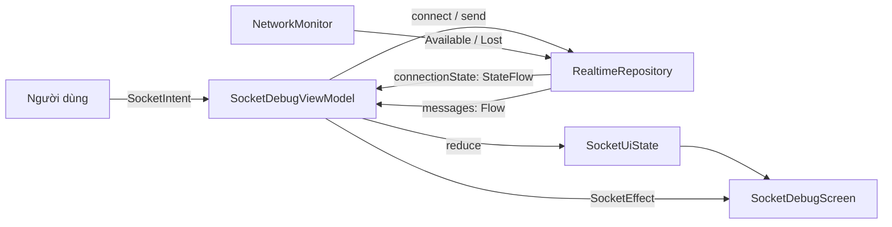

# WebSocket — lý thuyết & giải thích code

Tài liệu này gồm 2 phần:
- **Phần A**: lý thuyết giao thức (thứ bị hỏi trong phỏng vấn).
- **Phần B**: code trong `app/src/main/java/.../socket/` hoạt động thế nào, và **vì sao** viết vậy.

---

# PHẦN A — LÝ THUYẾT

## A1. Vấn đề WebSocket sinh ra để giải quyết

HTTP là **request/response, một chiều**: client hỏi, server mới được trả lời. Server **không có
cách nào chủ động đẩy** dữ liệu xuống.

Bốn cách né, xếp theo độ tệ:

| Cách | Cơ chế | Vấn đề |
|---|---|---|
| **Short polling** | client gọi API mỗi 2s | 99% request trả về rỗng; tốn pin, tốn băng thông, độ trễ = chu kỳ poll |
| **Long polling** | server giữ request treo tới khi có data mới | mỗi tin nhắn = 1 vòng TCP/TLS mới; proxy hay tự cắt sau 30–60s |
| **SSE** (Server-Sent Events) | 1 kết nối HTTP giữ mở, server stream xuống | **một chiều** (chỉ server→client), chỉ gửi được text |
| **WebSocket** | nâng cấp HTTP thành kênh TCP song công | phức tạp hơn, phải tự lo reconnect/heartbeat |

WebSocket = **full-duplex** (hai bên gửi bất cứ lúc nào, không cần xin phép) trên **một kết nối
TCP duy nhất**, sau khi bắt tay xong thì overhead mỗi frame chỉ **2–14 byte** (so với vài trăm
byte header HTTP mỗi request).

> Đối chiếu Kotlin: HTTP request/response giống `suspend fun` — gọi, chờ, có kết quả, xong.
> WebSocket giống một `Channel` hai chiều mở sẵn — không ai "gọi" ai, cả hai cùng đọc/ghi.

## A2. Handshake — nó vẫn bắt đầu bằng HTTP

Client gửi một request HTTP bình thường có header xin nâng cấp:

```http
GET /echo HTTP/1.1
Host: realtime-ws-lab.onrender.com
Upgrade: websocket
Connection: Upgrade
Sec-WebSocket-Key: dGhlIHNhbXBsZSBub25jZQ==      ← 16 byte ngẫu nhiên, base64
Sec-WebSocket-Version: 13
```

Server đồng ý:

```http
HTTP/1.1 101 Switching Protocols
Upgrade: websocket
Connection: Upgrade
Sec-WebSocket-Accept: s3pPLMBiTxaQ9kYGzzhZRbK+xOo=
```

`Sec-WebSocket-Accept` = `base64(SHA1(key + "258EAFA5-E914-47DA-95CA-C5AB0DC85B11"))`.
Chuỗi GUID đó là hằng số ghi cứng trong RFC 6455.

**Câu hỏi hay bị hỏi: cái này để làm gì? Nó KHÔNG phải bảo mật.** Nó chứng minh server thật sự
hiểu giao thức WebSocket chứ không phải một cache/proxy ngây thơ vô tình trả về 101. Không có nó,
kẻ tấn công có thể lừa proxy cache một response và đầu độc kết nối sau.

**Vì sao handshake dùng HTTP:** để đi xuyên được hạ tầng sẵn có — port 80/443, proxy doanh
nghiệp, load balancer, firewall. Nếu WebSocket dùng port riêng thì bị chặn ở 90% mạng công ty.

Sau `101`, **kết nối TCP đó không còn là HTTP nữa**. Không còn header, không còn status code —
chỉ còn frame nhị phân của WebSocket.

## A3. Frame — cấu trúc gói tin

```
 0                   1                   2                   3
 0 1 2 3 4 5 6 7 8 9 0 1 2 3 4 5 6 7 8 9 0 1 2 3 4 5 6 7 8 9 0 1
+-+-+-+-+-------+-+-------------+-------------------------------+
|F|R|R|R| opcode|M| Payload len |    Extended payload length     |
|I|S|S|S|  (4)  |A|     (7)     |            (16/64)             |
|N|V|V|V|       |S|             |                               |
| |1|2|3|       |K|             |                               |
+-+-+-+-+-------+-+-------------+-------------------------------+
|         Masking-key (4 byte, chỉ khi MASK=1)                  |
+---------------------------------------------------------------+
|                        Payload Data                            |
+---------------------------------------------------------------+
```

| Trường | Ý nghĩa |
|---|---|
| **FIN** | 1 = frame cuối của message. Message dài có thể chẻ nhiều frame (fragmentation). |
| **opcode** | `0x1` text, `0x2` binary, `0x0` continuation, `0x8` **close**, `0x9` **ping**, `0xA` **pong** |
| **MASK** | Frame **client → server BẮT BUỘC mask**. Server → client **cấm mask**. |
| **Payload len** | 0–125 = độ dài luôn; 126 = đọc thêm 2 byte; 127 = đọc thêm 8 byte |

> Đối chiếu Kotlin: `opcode` chính là discriminator của một `sealed interface Frame`.
> `FIN` là cờ "đây là phần tử cuối" — giống `Flow` phát xong thì complete.

**Vì sao client phải mask?** Không phải để mã hoá (masking key nằm ngay trong frame, ai cũng đọc
được). Nó chống **cache poisoning**: nếu payload không mask, kẻ tấn công có thể tạo một payload
trông y hệt một HTTP request hợp lệ, khiến proxy trung gian tưởng đó là request thật và cache lại
nội dung độc. Mask ngẫu nhiên từng frame làm proxy không bao giờ thấy được chuỗi cố định.

**Control frame** (close/ping/pong): payload tối đa **125 byte**, **không được fragment**, và
được phép chen vào giữa các fragment của một message dữ liệu.

## A4. Ping / Pong — và vấn đề half-open

Đây là phần quan trọng nhất về mặt thực chiến.

**Half-open connection**: một đầu đã chết (bật máy bay, rớt sóng, process server bị kill -9,
NAT gateway xoá mapping) nhưng đầu kia **không hề biết**. Nó vẫn thấy socket "mở", vẫn hiển thị
"đã kết nối", vẫn `send()` thành công — dữ liệu bay vào hư không.

Vì sao TCP không tự phát hiện:
- TCP **không gửi gì khi im lặng**. Không có traffic thì không có cách nào biết đầu kia còn sống.
- `SO_KEEPALIVE` của TCP mặc định **tắt**, và khi bật thì mặc định Linux là **2 tiếng** mới thăm
  dò lần đầu. Vô dụng cho chat.
- Nếu bạn `send()` vào một kết nối đã chết, TCP sẽ retransmit theo cấp số nhân và chỉ báo lỗi sau
  **~15 phút** (`tcp_retries2` = 15 lần trên Linux).

> Đối chiếu Kotlin: half-open giống `await()` trên một `CompletableDeferred` mà **không ai bao giờ
> gọi `complete()`**. Không có exception, không có gì hết — chỉ treo mãi. Và đây đúng nghĩa đen là
> cái đang xảy ra trong `connectOnce()` của chúng ta.

**Giải pháp: ping/pong ở tầng WebSocket.** Client gửi frame `0x9` (ping) định kỳ; peer **bắt buộc
theo RFC** phải trả frame `0xA` (pong) sớm nhất có thể. Không thấy pong trong khoảng thời gian
định trước ⇒ kết luận kết nối đã chết, chủ động huỷ và nối lại.

Nó giải quyết **hai** việc cùng lúc:
1. **Phát hiện chết sớm** — 20 giây thay vì 15 phút.
2. **Giữ NAT mapping sống** — router/carrier NAT xoá mapping của kết nối im lặng sau khoảng
   **30 giây – 5 phút** (mạng di động thường ngắn nhất). Traffic định kỳ giữ mapping không bị dọn.

Chọn chu kỳ ping là đánh đổi: ngắn quá thì tốn pin (mỗi ping đánh thức radio, mà chuyển
radio từ idle → active tốn nhiều năng lượng hơn chính gói tin), dài quá thì NAT chết và phát hiện
lỗi chậm. **20–30 giây** là vùng phổ biến.

> Lưu ý phân biệt: **ping/pong tầng WebSocket** (frame 0x9/0xA, OkHttp tự làm, invisible với code
> app) khác với **"ping" mà màn debug của chúng ta gửi** — cái sau là một text message thường
> `"PING:<timestamp>"` để đo RTT. Đừng lẫn hai thứ khi bị hỏi.

## A5. Close code — đóng có kỷ luật

Đóng đúng chuẩn là **bắt tay 2 chiều**: A gửi frame close → B trả frame close → mới đóng TCP.
Đóng TCP thẳng mà không gửi close frame là "abnormal closure".

| Code | Nghĩa | Ai sinh ra |
|---|---|---|
| `1000` | Normal closure — xong việc | ứng dụng |
| `1001` | Going away — server tắt / tab đóng | ứng dụng |
| `1002` | Protocol error | thư viện |
| `1006` | **Abnormal** — TCP đứt mà không có close frame | **thư viện tự sinh, KHÔNG BAO GIỜ lên dây** |
| `1011` | Internal server error | server |
| `3000–3999` | Đăng ký với IANA (framework/thư viện) | — |
| `4000–4999` | **Private use** — app tự định nghĩa | ứng dụng |

**`1006` là mã bạn phải hiểu**: nó không tồn tại trên dây, thư viện sinh ra để nói "kết nối chết
bất thường, tôi không nhận được close frame". Nó luôn có nghĩa **nên retry**.

Ngược lại, dải **4000–4999** là chỗ app cắm business logic. Project này dùng **`4001` = "token bị
thu hồi, đừng nối lại nữa"** — xem `CloseReason.isFatal()`. Đây là cách phân biệt
**lỗi tạm thời (retry)** với **lỗi vĩnh viễn (dừng hẳn)**; không phân biệt thì client sẽ nối lại
vô hạn vào một server đang cố đuổi nó đi.

## A6. Reconnect: exponential backoff + jitter

Kết nối realtime **chắc chắn sẽ đứt** — đó là giả định thiết kế, không phải trường hợp lỗi.

**Nối lại ngay lập tức là sai**: server vừa restart mà 100k client đập vào cùng lúc thì nó chết
lần nữa. Đây là **thundering herd**.

Công thức trong `BackoffPolicy`:

```
ceiling(attempt) = min(cap, base × factor^(attempt−1))     // 500ms, 1s, 2s, 4s… trần 30s
delay            = random(0, ceiling)                       // FULL JITTER
```

- **Exponential**: mỗi lần thất bại chờ gấp đôi — server càng lâu chưa dậy thì càng ít bị đấm.
- **Cap (trần)**: không có trần thì sau 20 lần thử là chờ 6 ngày. Trần 30s.
- **Full jitter**: **quan trọng nhất và hay bị bỏ quên**. Không có jitter, cả triệu client mất
  mạng cùng lúc sẽ nối lại đúng cùng một mili-giây — đường cong tải là các cột nhọn. Random hoá
  làm nó phẳng ra. AWS gọi biến thể này là "full jitter" và đo được nó tốt hơn "equal jitter".
- **Reset về 0 khi kết nối THÀNH CÔNG** — không reset thì sau vài giờ chạy, một cú đứt bình
  thường cũng phải chờ 30s mới nối lại.

**Và một tối ưu mà app tốt nào cũng có:** nếu đang chờ backoff 30s mà **Wi-Fi vừa bật lại** thì
phải nối **NGAY**, không ngồi đợi hết 30s. Đó là lý do tồn tại của `NetworkMonitor`.

## A7. ws:// vs wss:// và chuyện cleartext trên Android

| | Port mặc định | Tầng dưới |
|---|---|---|
| `ws://` | 80 | TCP trần |
| `wss://` | 443 | TCP + TLS |

**Luôn dùng `wss://` ở production.** Không chỉ vì mã hoá: proxy trung gian hay "nghịch" traffic
port 80 và làm hỏng frame WebSocket. Traffic TLS thì proxy không đọc được nên buộc phải để yên —
tỉ lệ kết nối thành công qua mạng công ty/carrier cao hơn hẳn.

**Android**: từ **API 28**, cleartext (HTTP / `ws://` không TLS) bị **chặn mặc định** — OkHttp ném
`CLEARTEXT communication to <host> not permitted by network security policy`.

Project này **chỉ dùng `wss://`** nên không khai gì cả. Nếu có ngày cần trỏ vào server node chạy
local, cách đúng là mở cleartext **chỉ cho debug build** bằng `app/src/debug/AndroidManifest.xml`:

```xml
<application android:usesCleartextTraffic="true" />
```

Đặt ở source set `debug` thì release build **vẫn bị chặn** — đây là điểm hay bị làm sai (nhét
thẳng vào `src/main` là mở cleartext cho cả bản phát hành).

`10.0.2.2` là địa chỉ alias mà emulator dùng để trỏ về `localhost` **của máy host** — trong
emulator, `127.0.0.1` là chính emulator chứ không phải máy bạn.

---

# PHẦN B — CODE HOẠT ĐỘNG THẾ NÀO

## B1. Bản đồ

```
socket/
├── domain/                        ← KHÔNG biết OkHttp/Android là gì. Thuần Kotlin.
│   ├── RealtimeRepository.kt        interface + ConnectionState + CloseReason
│   ├── NetworkMonitor.kt            interface + NetworkStatus
│   └── BackoffPolicy.kt             công thức backoff (hàm thuần → unit test được)
├── data/                          ← Chỗ DUY NHẤT biết OkHttp/ConnectivityManager
│   ├── RealtimeRepositoryImpl.kt    vòng lặp reconnect — nơi mọi thứ khó nằm ở đây
│   └── AndroidNetworkMonitor.kt     ConnectivityManager → Flow
├── ui/                            ← MVI
│   ├── SocketContract.kt            State + Intent + Effect + label()
│   ├── SocketDebugViewModel.kt      reducer
│   └── SocketDebugScreen.kt         Compose
└── di/SocketGraph.kt              ← repository là singleton theo Application
```

**Luật một chiều:** `ui → domain ← data`. Mũi tên **đều chĩa vào domain**. `domain` không import
gì của framework — kiểm bằng cách nhìn danh sách `import` ở đầu file, không cần tin lời ai.

Đổi OkHttp sang thư viện khác ⇒ chỉ viết lại `data/`, `ui/` không đổi một dòng. Đó là toàn bộ giá
trị của việc chia tầng; nếu không đạt được điều đó thì chia tầng chỉ là tạo thêm folder.

## B2. Luồng dữ liệu



**Hai dòng ra khỏi repository, không phải một** — đây là quyết định thiết kế then chốt:

| | Bản chất | Kiểu | Vì sao |
|---|---|---|---|
| `connectionState` | **giá trị hiện tại** | `StateFlow` | ai subscribe lúc nào cũng phải đọc được sự thật ⇒ cần replay |
| `messages` | **sự kiện trôi qua** | `SharedFlow` (không replay) | phát lại tin nhắn cũ mỗi lần vào màn là sai |

Bản đầu tiên gộp cả hai vào một `Flow<ConnectionEvent>`. Hậu quả thật: Activity bị destroy hẳn
(đổi ngôn ngữ hệ thống, process bị kill rồi restore) → ViewModel mới khởi tạo `Disconnected`
trong khi socket **vẫn đang Connected** → UI nói dối tới khi có event kế tiếp. Chữa bằng
`replay = 1` thì tin nhắn cũ bị phát lại — sai kiểu khác. **Gộp hai bản chất khác nhau vào một
kênh thì buộc phải chọn một semantics, và bên còn lại luôn sai.**

## B3. Trái tim: vòng lặp reconnect

`RealtimeRepositoryImpl.runConnectionLoop()`:

```
while (còn sống) {
    publish(Connecting)
    reason = connectOnce(url)          ← suspend TỚI KHI kết nối này chết
    if (reason.isFatal()) {            ← close code 4001, hoặc URL sai
        publish(Failed); break
    }
    n = ++attempt
    publish(Reconnecting(n, waitMs))
    awaitBackoff(waitMs)               ← chờ, NHƯNG tỉnh sớm nếu mạng vừa về
}
```

Điểm hay của cấu trúc này: **reconnect không phải là "xử lý lỗi", nó là vòng lặp bình thường**.
Kết nối chết chỉ là điều kiện để đi tiếp vòng lặp. Không có `try/catch` rải rác, không có callback
lồng nhau.

### `connectOnce()` — bắc cầu callback sang coroutine

OkHttp là **callback-based**; vòng lặp trên là **suspend**. Cầu nối là `CompletableDeferred`:

```kotlin
val closed = CompletableDeferred<CloseReason>()
val ws = client.newWebSocket(request, object : WebSocketListener() {
    override fun onClosed(...)  { closed.complete(CloseReason.ServerClose(code, reason)) }
    override fun onFailure(...) { closed.complete(CloseReason.NetworkFailure(...)) }
})
return try { closed.await() } finally { ws.cancel() }   // suspend tới khi 1 trong 2 callback nổ
```

`closed.await()` treo coroutine cho tới khi listener gọi `complete()`. Đúng một dòng thay cho cả
một máy trạng thái callback.

> Đây là pattern chuẩn để bọc **bất kỳ** callback API nào của Android thành coroutine.
> Anh em của nó: `suspendCancellableCoroutine` (cho one-shot) và `callbackFlow` (cho dòng sự kiện
> — chính là thứ `AndroidNetworkMonitor` dùng).

### `awaitBackoff()` — chờ nhưng tỉnh sớm

```kotlin
withTimeoutOrNull(waitMs) {
    networkMonitor.status()
        .dropWhile { it == NetworkStatus.Available }   // ← mấu chốt
        .first { it == NetworkStatus.Available }
}
```

Đọc từ trong ra: "chờ tới khi mạng Available, nhưng tối đa `waitMs`".

`dropWhile` là chỗ dễ sai nhất. Nếu **ngay lúc này đang có mạng** (server tự đá mình ra chứ không
phải rớt sóng) thì `first { Available }` sẽ khớp **ngay lập tức** và hàm trả về tức thì ⇒ backoff
coi như không tồn tại ⇒ reconnect storm. `dropWhile` bỏ qua giá trị hiện tại, buộc phải đi qua
**đúng chuyển dịch `Lost → Available`** mới tỉnh.

## B4. `AndroidNetworkMonitor` — cái bẫy `Flow` lạnh

```kotlin
callbackFlow {
    val callback = object : ConnectivityManager.NetworkCallback() {
        override fun onAvailable(n: Network) { trySend(NetworkStatus.Available) }
        override fun onLost(n: Network)      { trySend(currentStatus()) }   // ← không gửi Lost mù
    }
    cm.registerDefaultNetworkCallback(callback)
    awaitClose { cm.unregisterNetworkCallback(callback) }   // gỡ callback, không leak
}
    .distinctUntilChanged()
    .stateIn(scope, SharingStarted.Eagerly, currentStatus())   // ← BẮT BUỘC
```

**Hai bug thật đã sửa ở đây, cả hai đều đáng kể ra khi phỏng vấn:**

**1. `onLost` không được gửi thẳng `Lost`.** Khi máy chuyển **Wi-Fi → 4G**, hệ thống bắn
`onAvailable(mạng mới)` **TRƯỚC** rồi mới `onLost(mạng cũ)`. Gửi `Lost` mù sẽ kẹt trạng thái ở
"mất mạng" trong khi thực tế đang online. Phải **hỏi lại hệ thống** trạng thái hiện tại.

**2. `stateIn(Eagerly)` chứ không phải Flow lạnh, cũng không phải `WhileSubscribed`.**
`registerDefaultNetworkCallback` **luôn bắn `onAvailable` ngay tại thời điểm đăng ký** cho mạng
đang có (hành vi có tài liệu). Nếu trả `Flow` lạnh thì mỗi lần `awaitBackoff` collect là một
callback mới được đăng ký, và nó lập tức báo "Available" ⇒ điều kiện "mạng vừa quay lại" **luôn
đúng** ⇒ backoff bị cắt về ~0ms ⇒ reconnect storm. `WhileSubscribed` tái hiện y hệt bug đó vì
repository subscribe/unsubscribe liên tục giữa các lần chờ. **Bắt buộc `Eagerly`** — một callback
duy nhất cho cả vòng đời app.

Và `currentStatus()` kiểm `NET_CAPABILITY_VALIDATED` (API 23) chứ không chỉ `NET_CAPABILITY_INTERNET`:
`VALIDATED` nghĩa là hệ thống đã **thật sự thử ra Internet và thành công** — loại được Wi-Fi
captive portal (bắt được sóng quán cà phê nhưng chưa đăng nhập), thứ mà `INTERNET` không phân biệt nổi.

## B5. Ba cơ chế chống race — phần bị hỏi sâu nhất

Callback của OkHttp chạy trên **thread của OkHttp**, vòng lặp chạy trên `Dispatchers.Default`,
người dùng bấm nút trên **main thread**. Ba thread cùng đụng vào một mớ state.

### 1. `generation` — con dấu thế hệ

Mỗi `connect()`/`disconnect()` tăng `generation` lên 1. Mọi thứ phát ra ngoài đều mang theo con
dấu của vòng lặp sinh ra nó; dấu cũ thì **vứt**.

Không có nó: bấm "Ngắt" đúng lúc `onOpen` của vòng lặp cũ vừa chạy trên thread OkHttp ⇒ UI kẹt ở
"đã kết nối" dù kết nối đã bị huỷ.

### 2. `lifecycleLock` — vì kiểm-rồi-ghi là **hai** lệnh

```kotlin
private fun publish(gen: Long, state: ConnectionState) {
    synchronized(lifecycleLock) {
        if (gen == generation.get()) _connectionState.value = state
    }
}
```

Vì sao không chỉ `if (...) value = state`: đó là hai lệnh rời rạc. Thread A (vòng lặp cũ) đọc
`generation` thấy khớp → bị OS cắt ngang → thread B chạy `disconnect()` (tăng generation, ghi
`Disconnected`) → A tỉnh lại và ghi `Connected` **đè lên**. Đúng con bug mà con dấu thế hệ ra đời
để diệt, chỉ dịch xuống nhỏ hơn một tầng. Bọc cặp (đọc, ghi) vào cùng lock thì cửa sổ đó biến mất.

Hàm `claimSocket()` dùng chung lock này, vì lý do y hệt.

**Quy tắc bất di bất dịch của lock này: KHÔNG gọi vào OkHttp khi đang giữ nó.** `ws.cancel()` có
thể gọi `onFailure` ngay trên thread hiện tại; nếu listener chạm vào `publish()` thì tự deadlock.
Vì vậy trong `disconnect()`, `ws.cancel()` được đẩy ra **ngoài** khối `synchronized`.

### 3. `compareAndSet` chứ không `set(null)` mù

`connect()` huỷ vòng lặp cũ rồi `launch` vòng lặp mới **NGAY**. Nhưng `cancel()` là **bất đồng
bộ** — khối `finally` dọn dẹp của vòng lặp cũ hoàn toàn có thể chạy **SAU** khi vòng lặp mới đã
gán socket của nó. `set(null)` mù khi đó xoá mất socket đang sống ⇒ `send()` trả `false` vĩnh viễn.
`compareAndSet(ws, null)` chỉ xoá **đúng socket của mình**.

Chiều ngược lại cũng vậy: `onOpen` của vòng lặp cũ có thể nổ **muộn** và ghi đè socket đang sống
bằng một socket sắp bị cancel ⇒ dùng `claimSocket(gen, ...)`, không `set()` mù.

### Và: `currentSocket` vs `openSocket` — hai biến, không phải một

| | Gán khi nào | Dùng làm gì |
|---|---|---|
| `currentSocket` | ngay sau `newWebSocket()` | để `cancel()` khi ngắt |
| `openSocket` | **trong `onOpen`** | chỉ cái này mới được phép `send()` |

**Vì sao phải tách:** OkHttp cho gọi `send()` ngay sau `newWebSocket()` và **trả `true`** — nó xếp
message vào hàng đợi chờ handshake xong. Nếu `send()` chỉ kiểm "socket != null" thì lúc đang
CONNECTING vẫn trả `true`, sai với hợp đồng "trả false nếu chưa kết nối" mà UI đang tin.

### Bonus: `attempt` là `AtomicInteger`, không phải `var`

Nó được **ghi trên thread OkHttp** (trong `onOpen`, để reset về 0) và **đọc trên dispatcher của
vòng lặp**. Với `var` thường, JMM không đảm bảo thread đọc thấy giá trị thread kia vừa ghi ⇒
backoff có thể **không bao giờ reset** dù kết nối đã thành công. Bug này không crash, không log,
chỉ làm app chậm nối lại — loại tệ nhất.

## B6. Ai sở hữu vòng đời kết nối

**App sở hữu, không phải màn hình.**

`SocketGraph` giữ repository làm singleton theo Application. `SocketDebugViewModel.onCleared()`
**chỉ dừng vòng ping đo RTT, KHÔNG gọi `disconnect()`**.

Bản trước gọi `disconnect()` trong `onCleared` và nó **tự phủ định lý do tồn tại của
`SocketGraph`**: dựng singleton để kết nối sống lâu hơn màn hình, rồi lại giết nó ngay khi màn
hình chết. Khi có hai màn dùng chung một kết nối thì hỏng thật: pop màn A ⇒ `onCleared` ⇒
`disconnect` ⇒ màn B đứt.

Đã cân nhắc và **loại** phương án refcount (`SharingStarted.WhileSubscribed`): URL do người dùng
gõ ở runtime, nên khi subscriber cuối rời đi rồi có người mới vào, refcount **không biết phải nối
lại vào URL nào**. "Nên kết nối tới đâu" là input của người dùng, không suy ra được từ số lượng
người đang xem.

**Cái giá phải trả (đang chấp nhận):** rời màn hình mà chưa bấm "Ngắt" thì vòng reconnect vẫn chạy
nền tới khi process chết — xấu nhất 1 lần thử mỗi 30s do backoff có trần. App thật phải buộc kết
nối vào **process foreground** (`ProcessLifecycleOwner`) hoặc vào phiên đăng nhập.

## B7. Tầng UI — MVI

```
Intent (người dùng) ─┐
trạng thái kết nối ──┼─→ Change ─→ reduce(State, Change): State ─→ Compose vẽ
tin nhắn đến ────────┘                    ↑ HÀM THUẦN
```

- **`onIntent` là cửa vào DUY NHẤT.** View không gọi thẳng repository.
- **`reduce` là hàm thuần** — chỗ duy nhất tạo state mới. Không I/O, không thời gian, không random
  ⇒ test được mà không cần socket, không cần Robolectric.
- **`Effect` đi qua `Channel`, không nằm trong State.** Toast mà để trong State thì mỗi lần
  recompose / xoay màn hình nó lại hiện lại.
- **URL cũng nằm trong State** — View không giữ state riêng, kể cả text field.

### Đo RTT: mốc thời gian nằm TRONG payload

```kotlin
send("PING:${SystemClock.elapsedRealtime()}")
// khi pong về:
val rtt = SystemClock.elapsedRealtime() - text.removePrefix("PING:").toLong()
```

Hai chi tiết:

**1. `elapsedRealtime()` chứ không `currentTimeMillis()`.** `elapsedRealtime` đếm từ lúc boot và
**đơn điệu tăng**; `currentTimeMillis` là wall-clock, sẽ **nhảy** khi NTP chỉnh giờ hoặc người
dùng đổi múi giờ giữa lúc đo ⇒ RTT ra số vô nghĩa, có thể âm. **Đo khoảng thời gian thì luôn dùng
đồng hồ đơn điệu.**

**2. Nhét mốc vào chính payload, không lưu vào biến.** Bản cũ lưu `lastPingSentAt` và bị mọi ping
ghi đè: khi có 2 ping bay đồng thời (route `/slow` trễ 2s, hoặc bấm Ping tay xen với ping tự động)
thì pong của ping **thứ nhất** bị trừ theo mốc của ping **thứ hai** ⇒ số vô nghĩa. Đây cũng là
cách RTCP (WebRTC) làm: timestamp đi kèm gói, không giữ ở ngoài.

## B8. Đọc code theo 5 kịch bản

| Kịch bản | Đường đi trong code |
|---|---|
| **Kết nối thành công** | `connect()` → gen++ → `runConnectionLoop` → `publish(Connecting)` → `connectOnce` → OkHttp `onOpen` → `claimSocket(openSocket)` + `attempt.set(0)` + `publish(Connected)` → ViewModel bật ping loop |
| **Server đóng bình thường** | `onClosing` → trả close frame → `onClosed` → `closed.complete(ServerClose(1000))` → `isFatal()` = false → `attempt=1` → `publish(Reconnecting)` → `awaitBackoff` → lặp lại |
| **Server đuổi (route `/policy`, code 4001)** | `onClosed(4001)` → `isFatal()` = **true** → `publish(Failed)` → **`break`**, dừng hẳn |
| **Bật máy bay (half-open)** | im lặng ~20s → OkHttp không nhận pong → `onFailure(SocketTimeoutException)` → `NetworkFailure` → retry. Song song: `NetworkMonitor` phát `Lost` |
| **Tắt máy bay giữa lúc chờ backoff 30s** | `NetworkMonitor` phát `Available` → `awaitBackoff` đang treo ở `dropWhile→first` **tỉnh ngay** → `withTimeoutOrNull` chưa hết giờ đã trả về → nối lại **NGAY**, không đợi hết 30s |

## B9. Server mock — cách test từng cơ chế

`server/server.js`, deploy `wss://realtime-ws-lab.onrender.com`:

| Route | Hành vi | Dùng để test |
|---|---|---|
| `/echo` | trả nguyên văn | happy path, đo RTT |
| `/slow` | trả sau 2s | RTT cao, 2 ping bay đồng thời |
| `/drop` | ngắt ngẫu nhiên | chuỗi backoff + jitter, reset khi nối lại được |
| `/policy` | đóng với code **4001** | `isFatal()` → dừng hẳn, không retry |

Ghi số đo vào bảng cuối `server/README.md`. **Chưa đo thì để `chưa đo`, không điền số bịa.**

---

## B10. Việc còn nợ (đã phân tích, chưa làm)

- **Tách module `:core-network`** — hiện `domain` không import framework là do *kỷ luật package*,
  compiler không chặn. Tách module thì `build.gradle.kts` của domain không khai OkHttp ⇒ sai là
  không compile. Đây là câu trả lời mạnh cho "làm sao bạn đảm bảo domain sạch?".
- **Test cho vòng lặp reconnect** — cần `turbine` + `kotlinx-coroutines-test` + `mockwebserver`
  (MockWebServer hỗ trợ WebSocket sẵn) + một `FakeNetworkMonitor`. Hiện chỉ có `BackoffPolicyTest`.
  Cũng chưa có test cho `reduce` — mà nó là hàm thuần, rẻ nhất để test.
- **Dời logic RTT xuống tầng data** — `"PING:"` là format wire message, không phải việc của UI.
- **`SocketGraph` → Hilt `@Singleton`** (hiện là service locator: static, không reset được giữa test).
- **Hoist ViewModel ra khỏi `SocketDebugScreen`** (nhận `state` + `onIntent`) để `@Preview` được.
- **`log: List<String>`** — `(s.log + line).takeLast(100)` cấp phát 2 list mỗi dòng log. Vô hại ở
  10s/ping, nhưng là O(n) mỗi message khi throughput cao.

---

## Phụ lục — câu hỏi hay gặp, trả lời ngắn

**WebSocket khác long-polling ở đâu?** Long-polling mỗi tin nhắn là một vòng TCP/TLS mới và chỉ
server→client mới có ý nghĩa; WebSocket là một TCP duy nhất, hai chiều, overhead 2–14 byte/frame.

**Vì sao handshake phải qua HTTP?** Để đi xuyên proxy/firewall/LB sẵn có trên port 80/443.

**Vì sao client bắt buộc mask frame?** Chống cache poisoning ở proxy trung gian, không phải bảo mật.

**Half-open là gì, phát hiện thế nào?** Một đầu chết mà đầu kia không biết, vì TCP không gửi gì khi
im lặng và keepalive mặc định là 2 tiếng. Phát hiện bằng ping/pong tầng WebSocket (frame 0x9/0xA),
chu kỳ 20–30s.

**Vì sao backoff phải có jitter?** Chống thundering herd — cả vùng mất mạng rồi có lại cùng lúc sẽ
reconnect đúng cùng một mili-giây và đấm sập gateway.

**1006 nghĩa là gì?** Abnormal closure — thư viện tự sinh khi TCP đứt mà không nhận được close
frame. Không bao giờ xuất hiện trên dây. Luôn nên retry.

**Khi nào KHÔNG được retry?** Khi server đóng bằng close code mang nghĩa "đừng nối lại" (project
này dùng 4001, dải private-use 4000–4999), hoặc URL không parse được.

**Ping của WebSocket và ping đo RTT của bạn khác gì nhau?** Cái đầu là control frame 0x9/0xA do
OkHttp tự lo, app không thấy. Cái sau là text message thường có timestamp trong payload.

**Kết nối realtime nên thuộc vòng đời nào?** Không thuộc màn hình. Thuộc process/phiên đăng nhập —
nếu không, pop một màn là các màn khác đứt kết nối theo.
